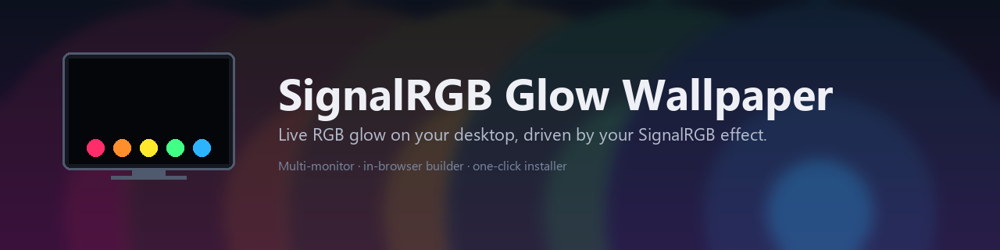
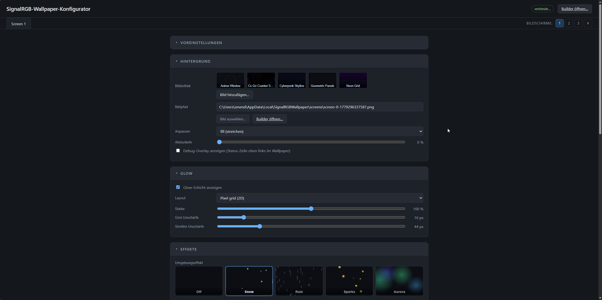
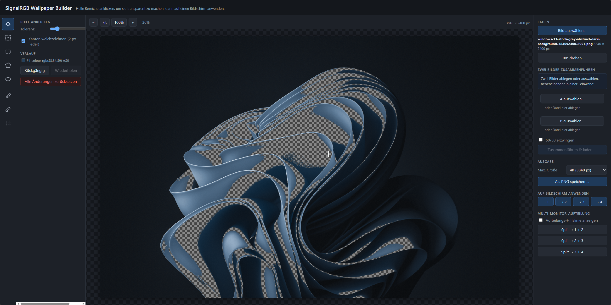
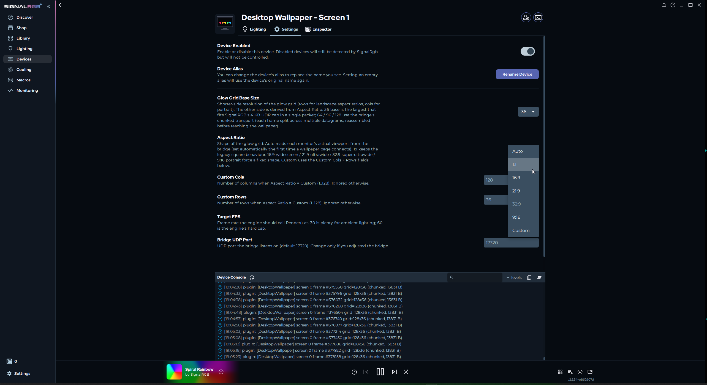
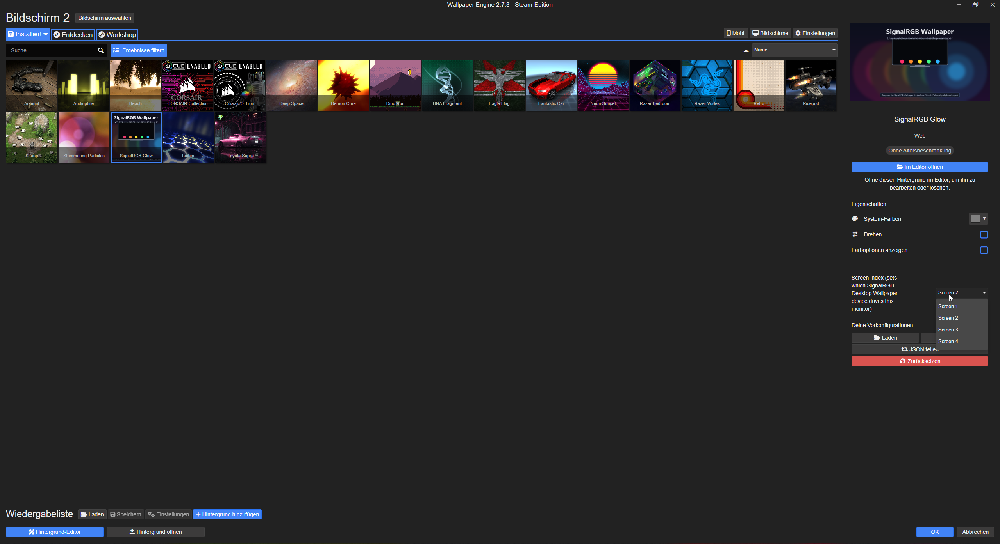

### **Live RGB glow on your desktop, driven by your SignalRGB effect.**

Multi-monitor · configurable per screen · one-click installer ·
Lively *and* Wallpaper Engine.

---

Your SignalRGB effect already drives keyboards, fans and strips —
**why not your desktop too?** This project lets the live colours from
SignalRGB shine through transparent regions of your wallpaper. Pick any
image, carve cut-outs into it (or use one of the bundled starters), and
the holes light up in whatever colour your current SignalRGB effect is
producing — in real time, 60 fps, with zero noticeable CPU cost.

Runs on top of [Lively Wallpaper](https://www.rocksdanister.com/lively/)
(free) or [Wallpaper Engine](https://www.wallpaperengine.io/) (paid, on
Steam). The one-click installer sets everything up — no Python, no
manual file copies, no terminal.

> Currently in the **v0.9.x stabilisation cycle** — the v0.8.x betas
> piled workflow polish on top of v0.8.0 (the first stable), and the
> v0.9.x betas added the bigger features (auto-cycle, hotkeys,
> per-app profiles, now-playing, Auto-cut Builder tool, multi-monitor
> wall, etc.). Turn on *Allow betas* in the tray to get them
> automatically. Full notes: [CHANGELOG](CHANGELOG.md).

## What you get

- 🌈 **Live RGB glow** behind a transparent background, 60 fps
- 🖥️ **Up to 4 monitors**, each fully independent or spanned
- 🖌️ **In-browser image editor** — pick any wallpaper, click out
  transparent regions, no Photoshop required
- 🎨 **Starter wallpaper library** — Cyberpunk Skyline, Neon Grid,
  Anime Window, Geometric Panels (more via *Add image…*)
- ⚙️ **Browser-based Configurator** — change background, glow,
  effects, widgets on-the-fly without restarting anything
- ✨ **Ambient effects** behind the wallpaper — snow, rain, sparks,
  aurora, plus a whole-screen audio-reactive glow layer
- 🧩 **11 desktop widgets** — clock, calendar, weather, sticky notes,
  countdowns, photo frame, quote of the day, CPU / RAM / network
  meters, audio spectrum
- 💾 **Preset slots** — save a complete "background + glow + widgets"
  combo per screen, switch with one click
- 🌐 **DE / EN UI**, auto-detected from your Windows locale
- 🎮 **Auto-pause** when a fullscreen app is active — no GPU drain
  during games

## See it in action

| Configurator | Wallpaper builder |
| :---: | :---: |
|  |  |
| *Pick a background from the bundled library or your own image, dial in glow strength, ambient effects and widgets — everything live in your browser.* | *Click any colour to make it transparent. Drag rectangles, polygons or ellipses. Soft brushes for fine control. Apply straight to a screen with one click.* |

| SignalRGB integration | Wallpaper Engine |
| :---: | :---: |
|  |  |
| *The plugin announces 1–4 "Desktop Wallpaper – Screen N" devices in SignalRGB. Aspect Ratio = Auto matches each monitor's real shape (ultrawide-friendly).* | *One Workshop-style bundle assigned to every monitor with a different **Screen index** per assignment. No manual canvas tricks needed.* |

## Quick start

### 1 · Install

> 📸 **Step-by-step walkthrough with screenshots:**
> [docs/installation.md](docs/installation.md#installer-walkthrough)

1. Grab `SignalRGBWallpaperSetup-<version>.exe` from
   [Releases](https://github.com/Delido/signalrgb-wallpaper/releases/latest).
2. Run it. **No admin needed** — installs per-user. The wizard's
   defaults match the most common path (Lively + auto-import + SignalRGB
   plugin + autostart + open the Configurator when done).
   - 🟢 **No Lively installed yet?** Tick *Auto-install Lively if not
     already present* and the installer downloads + silently installs
     the latest Lively from GitHub before importing the wallpapers.
   - 🟢 **Wallpaper Engine on Steam?** Auto-detected; the bundle goes
     straight into WE's *My Wallpapers*.

### 2 · Configure

After install, the Configurator opens automatically in your browser
at `http://127.0.0.1:17320/configurator`. Set the screen count
(top right, *Screens: 1 / 2 / 3 / 4*), pick a starter wallpaper
from the library strip, tweak the glow strength, optionally turn on
an ambient effect — done.

### 3 · Place SignalRGB devices

Open SignalRGB → **Layouts**. Drag each *Desktop Wallpaper – Screen N*
device onto the canvas where you want colours sampled from. For a
single monitor: cover the canvas. For two side-by-side monitors: left
half + right half. The [Help page](#help) and
[multi-screen guide](docs/multi-screen-setup.md) have worked examples.

### 4 · Assign in your wallpaper host

- **Lively users** — the installer dropped the four wallpapers into
  your Lively library. Right-click each *SignalRGB Glow – Screen N*
  tile → *Set as wallpaper* → pick the matching monitor.
- **Wallpaper Engine users** — open WE, *My Wallpapers* now contains
  *SignalRGB Glow*. Assign it to every monitor you want to drive,
  and in each per-wallpaper *Properties* panel pick a different
  *Screen index* (Screen 1 / 2 / 3 / 4).

> 💡 **Stuck or unsure which setup matches your monitors?** Right-
> click the bridge's tray icon → **Help…** for scenario walkthroughs
> (1 / 2 / 3 / 4 monitors × Lively / Wallpaper Engine, ultrawide,
> common pitfalls — all DE / EN).

## Requirements

- **Windows 10 or 11**
- **[SignalRGB](https://www.signalrgb.com/)** installed and able to drive
  your hardware (open it once, pick any effect; if no LEDs light up,
  fix that first)
- **A wallpaper host** — at least one:
  - **[Lively Wallpaper](https://www.rocksdanister.com/lively/)** —
    free, recommended. GitHub-installer build preferred; Microsoft Store
    / MSIX build also works. If you don't have Lively yet, the installer
    can fetch + install it for you.
  - **[Wallpaper Engine](https://www.wallpaperengine.io/)** — paid,
    on Steam. Auto-detected by the installer; one combined bundle gets
    dropped into `wallpaper_engine\projects\myprojects\`.

## Help

The tray icon's **Help…** entry opens a scenario-based walkthrough
covering every Lively / Wallpaper Engine setup for 1–4 monitors,
including ultrawide / non-16:9 panels and spanned configurations
(DE / EN, auto-localised). For docs beyond the in-app help:

- **[Installation guide](docs/installation.md)** — full installer
  walkthrough with screenshots and Windows path notes
- **[Multi-screen setup](docs/multi-screen-setup.md)** — placing
  SignalRGB devices on the canvas, assigning wallpapers per monitor
- **[Building glow wallpapers](docs/building-wallpapers.md)** —
  picking a source image, GIMP workflow, what looks good
- **[Tray reference](docs/tray-settings.md)** — every menu entry
  explained
- **[Troubleshooting](docs/troubleshooting.md)** — when things don't
  work
- **[Architecture](docs/architecture.md)** — wire formats, threading
  model, why the components are split the way they are
- **[Build from source](docs/building-from-source.md)** —
  PyInstaller + Inno Setup, dev loop

## How it works

The SignalRGB plugin registers as virtual lighting devices (one per
monitor) and samples your effect canvas every frame. Each frame goes
out as a UDP datagram to a small **bridge** (`SignalRGBBridge.exe`,
runs in your tray) that fans the colours out to one HTML wallpaper page
per monitor over WebSocket. The wallpaper page renders the colours as a
CSS-grid glow layer behind your background image. All per-screen
settings (background, glow, widgets, effects) live in the **in-browser
Configurator** which pushes changes live to the wallpaper without any
reload. Full architecture: [docs/architecture.md](docs/architecture.md).

## Manual install (no installer)

If you'd rather not run the installer:

| File | Where it goes |
| --- | --- |
| `SignalRGBBridge.exe` | Anywhere stable (e.g. `C:\Tools\SignalRGBWallpaper\`) |
| `SignalRGB_Desktop_Wallpaper.js` + `.qml` | `Documents\WhirlwindFX\Plugins\` |
| `SignalRGB_Glow_Screen{1,2,3,4}.zip` *(Lively)* | Drag each zip onto Lively |
| `SignalRGB_Glow_WE_Single.zip` *(Wallpaper Engine)* | Extract; drop `signalrgb-glow/` into `…\steamapps\common\wallpaper_engine\projects\myprojects\` |

Then run `SignalRGBBridge.exe`. The tray icon appears; right-click
→ *Configurator…* to set everything up.

## Uninstall

Windows Settings → **Apps** → SignalRGB Desktop Wallpaper → Uninstall.
The uninstaller removes the bridge, the auto-imported Lively folders
(`signalrgb-glow-screen-{1..4}\`), the WE bundle (`signalrgb-glow\`),
and the autostart registry entry. Your custom backgrounds, widgets and
presets in `%LOCALAPPDATA%\SignalRGBWallpaper\` stay; delete that folder
by hand to clear them too.

The SignalRGB plugin in `Documents\WhirlwindFX\Plugins\` is **not**
removed automatically — delete by hand if you want SignalRGB to forget
about it.

## What's new

**v0.9.x** is the current beta cycle and rolls up the bigger
post-v0.8 features — automation, more effects, and a much-improved
multi-monitor Builder workflow. Highlights since v0.8.0:

### Automation / convenience

- 🆕 **Wallpaper auto-cycle** — per-screen *Auto-cycle* block in
  the Background card, configurable interval / pool / order
  (v0.9.2-beta)
- 🆕 **Preset hotkeys** — global `Ctrl+Shift+1..4` swap presets
  on every active screen, toggle under tray → Advanced
  (v0.9.3-beta)
- 🆕 **Per-app / per-game profiles** — foreground-window watcher
  auto-switches presets when a specific exe runs; snapshots
  prior state and reverts on focus-out (v0.9.5-beta)
- 🆕 **Now-playing widget** — Windows SMTC; title + artist +
  optional progress bar, glow-tinted (v0.9.4-beta)
- 🆕 **In-app auto-update** — tray downloads and runs the new
  installer silently; tray button replaces the "go to releases
  page" prompt (v0.9.8-beta)

### Builder / Monitor Wall

- 🆕 **Monitor Wall** as primary right-panel nav — one tile per
  monitor, click drops in file / library / current canvas
  (v0.9.11-beta)
- 🆕 **⇔ Span canvas across monitors** — single click slices the
  current canvas into one chunk per screen, sized to each
  monitor's physical width; closes the merge → wall workflow
  gap for the *photos side-by-side → 7680×2160 → onto 2 ×
  2560×1440* flow (v0.9.13-beta)
- 🆕 **Right-panel rework** — Source → Wall → Output flow,
  Merge collapsed by default, Apply Wall full-width primary
  (v0.9.14-beta)
- 🆕 **Auto cut tool** ✨ — Otsu instant mode (no internet) +
  AI saliency mode that lazy-loads `onnxruntime-web` + RMBG-1.4
  on first click (v0.9.16 + v0.9.17 dim/undo fixes)

### Effects + UI

- 🆕 **5 new ambient effects** — Constellation, Fireflies
  (v0.9.12-beta) plus Plasma, Vortex, Bubbles (v0.9.15-beta).
  All written from scratch in the project's `AMBIENT_PRESETS`
  shape, no per-pen licence verification needed.
- 🆕 **First-run onboarding tour** — Configurator-side overlay
  with 7 steps, spotlight ring + tooltip on the live DOM;
  *Tour* button in the header replays (v0.9.10-beta)
- 🆕 **Ctrl+Z undo across settings** — per-screen ring buffer,
  20 entries (v0.9.10-beta)
- 🆕 **Setup health-check + Backup/Restore + Reset-screen** —
  tray *System status…* dialog and Configurator *Backup &
  Restore* card (v0.8.9-beta)
- 🆕 **Mirror mode per tab** — any screen can mirror any other;
  invariant enforced via `_block_if_mirror` /
  `_replicate_to_mirrors` (v0.8.8-beta)

### Bug fixes from the 0.8.x cycle

- 🐛 **Perf**: SignalRGB-startup lag fixed by coalescing 5×
  redundant `applyZoneSize` rebuilds into one (v0.8.1)
- 🐛 **Installer**: library.json no longer overwritten on
  upgrade — your uploads survive (v0.8.6-beta)
- 🐛 **Tray auto-update**: ShellExecuteW spawn replaces
  subprocess.Popen with DETACHED_PROCESS so the installer
  actually launches reliably (v0.9.17-beta)

Full version-by-version breakdown: [CHANGELOG.md](CHANGELOG.md).

## Roadmap

Open ideas grouped by impact-to-effort ratio. Pull requests welcome.
For the long-form version with per-item implementation notes +
licence-compatibility guidance, see [docs/roadmap.md](docs/roadmap.md).

> ✅ **Tiers 1 + 2 are fully shipped** as part of the v0.8.9 → v0.9.10
> beta cycle (setup health-check, backup/restore, Ctrl+Z undo,
> first-run tour, auto-cycle, preset hotkeys, per-app profiles,
> now-playing widget). Tier 3's Builder Auto-cut tool, auto-update,
> and the first two ambient batches have also shipped (v0.9.12 →
> v0.9.17). What's left below is the genuinely open work.

### 🛠️ Tier 3 — Power-user / polish (partial)

- **More ambient effects from MIT-licensed sources** — Constellation
  and Fireflies (v0.9.12), Plasma, Vortex and Bubbles (v0.9.15)
  shipped as the first two batches; further ports from
  [ykob](https://github.com/ykob)'s catalogue and similar MIT-
  licensed pens still on the menu. Per-pen licence check and
  attribution in [docs/credits.md](docs/credits.md) required for
  each one ported directly.
- **Winget package** — auto-update is done (tray downloads + runs
  the installer); the missing piece is a Winget manifest submission
  to `microsoft/winget-pkgs` so `winget install
  Delido.SignalRGBWallpaper` works. Needs an ongoing per-release
  manifest update.

### 🔌 Tier 4 — Ecosystem / integration

- **Home Assistant / MQTT bridge** — publish wallpaper state +
  sensor values via MQTT so users can write HA automations
  ("dim wallpaper when 'movie night' scene is active").
- **REST API** — already partially possible (`/library`, `/config`,
  `/hwmon/sensors`); formalise the full WS-equivalent surface with
  an OpenAPI spec + token auth so Stream Deck / scripts / external
  tools can drive the wallpaper without poking the WebSocket.
- **Plugin API for third-party widgets** — `%LOCALAPPDATA%\
  SignalRGBWallpaper\plugins\<name>\widget.js` with a defined
  contract. Long road to a community widget library; depends on
  the REST-API formalisation above.
- **Generic HTTP widget** — polls any URL on a schedule and
  renders a configurable Mustache template. Covers Discord unread /
  stocks / RSS / crypto / arbitrary REST APIs with one widget
  type instead of one per service. ~5-6 h.

### 🅿️ Parked

- **Mobile Configurator view** — would need the bridge to bind to
  `0.0.0.0` with a "this exposes your wallpaper config to the LAN"
  opt-in, and most users sit at the PC the wallpaper runs on.
- **Community wallpaper gallery** — high copyright-infringement
  risk for an unfiltered public submission flow (brand IP, anime
  stills, game art). The bundled starter library + per-user
  upload remain the supported path.

Got a wish that isn't here?
[Open an issue](https://github.com/Delido/signalrgb-wallpaper/issues/new)
and tag it `enhancement`.

## Contributing

Issues and PRs welcome. Bug reports should include:

- Windows version (Win+R → `winver`)
- SignalRGB version (Settings → About in SignalRGB)
- Lively / Wallpaper Engine version — say which one + Microsoft Store
  vs GitHub build for Lively
- The bridge log if relevant: run `SignalRGBBridge.exe` from a CMD
  window (or `python wallpaper_bridge\bridge.py` directly)

## Support / donate

This project is built and maintained in spare time. If it saves you
the hassle of writing your own SignalRGB → wallpaper plumbing, or
if seeing a glow that matches your effect just makes you smile every
morning, a small tip keeps the motivation up.

Issues, feature requests and pull requests are also very welcome —
even just an [issue](https://github.com/Delido/signalrgb-wallpaper/issues)
saying "this is broken on my machine" helps a lot.

## License

[MIT](LICENSE) © 2026 Sebastian Mendyka ([@Delido](https://github.com/Delido))
