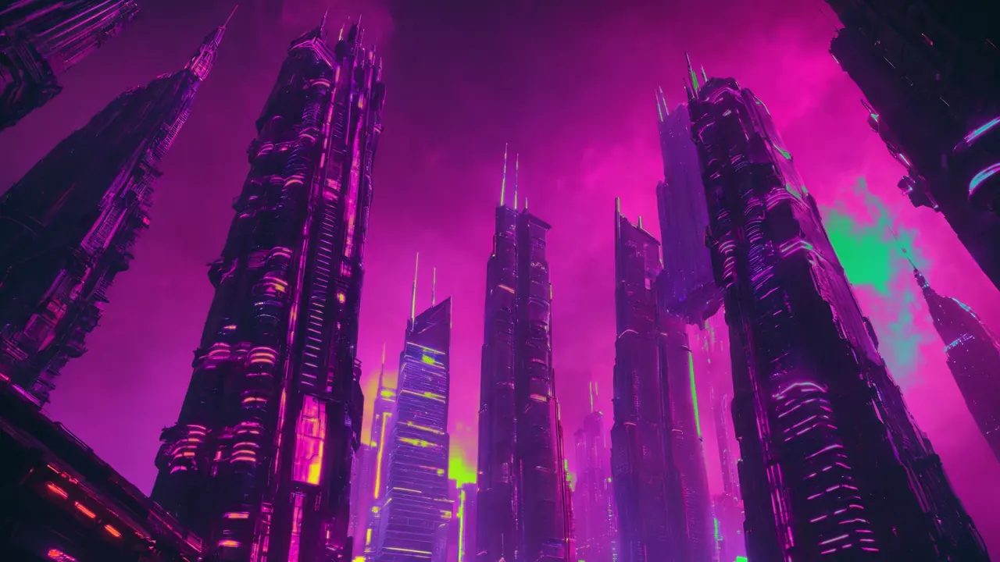
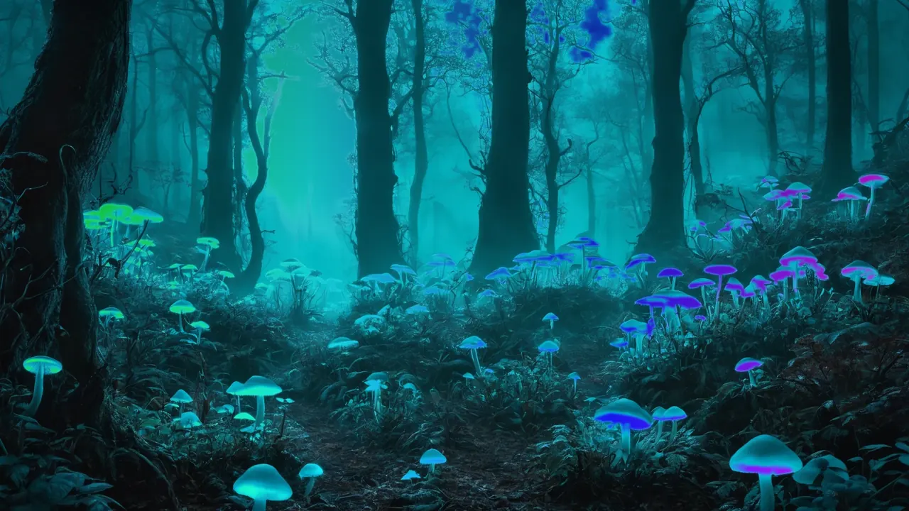

<div align="center">


[](https://github.com/Delido/signalrgb-wallpaper/releases/latest)
[](https://github.com/Delido/signalrgb-wallpaper/releases)
[](LICENSE)
[](#requirements)
[](https://paypal.me/SMendyka)

### **Live RGB glow on your desktop, driven by your SignalRGB effect.**

Multi-monitor · per-screen config · one-click installer · Lively *and*
Wallpaper Engine.

</div>

---

<div align="center">

| Tokyo neon alley | Cyberpunk towers | Bioluminescent grove |
| :---: | :---: | :---: |
|  |  |  |

*Bundled wallpapers with saliency-cut alpha — your live SignalRGB
glow shines through the transparent neon zones.*

</div>

---

Your SignalRGB effect already drives keyboards, fans and strips —
**why not your desktop too?** This project lets the live colours from
SignalRGB shine through transparent regions of your wallpaper. Pick a
bundled image, drop in your own, or carve cut-outs in the in-browser
Builder — the holes light up in whatever colour your current SignalRGB
effect is producing, in real time, at 60 fps, with negligible CPU cost.

Runs on top of **[Lively Wallpaper](https://www.rocksdanister.com/lively/)**
(free) or **[Wallpaper Engine](https://www.wallpaperengine.io/)** (paid,
on Steam). The one-click installer sets everything up — no Python, no
manual file copies, no terminal.

## What you get

### Visuals

- 🌈 **Live RGB glow** behind a transparent background, 60 fps
- 🎨 **42 bundled wallpapers** spanning cyberpunk, synthwave, aurora,
  underwater, sci-fi — each in **1080p + 4K** with saliency-cut alpha
  baked in
- 🎬 **Video backgrounds** (MP4 / WebM / MOV / M4V)
- ✨ **Ambient effects** — snow, rain, sparks, aurora, constellation,
  fireflies, plasma, vortex, bubbles + a screen-wide audio-reactive
  glow layer
- 🧩 **12 desktop widgets** — clock, calendar, weather, sticky notes,
  countdowns, photo frame, quote of the day, CPU / RAM / network
  meters, hardware sensors, audio spectrum, now-playing, RSS feed

### Tools

- 🖌️ **In-browser Builder** — pick any image, click out transparent
  regions, Auto-Cut for one-click bright-region detection, reference-
  image colour picker
- ⚙️ **In-browser Configurator** — change background, glow, effects,
  widgets on-the-fly without restarting anything; live WYSIWYG preview
- 🎯 **Quick Looks** — 10 pre-built bundles (Streamer / Focus /
  Pomodoro / Gaming / …) swap effects + widget layout in one click
- 💾 **Preset slots** — save full "background + glow + widgets" combos
  per screen, switch with one click, undo via Ctrl+Z

### Multi-monitor

- 🖥️ **Up to 4 bridge screens**, each independent, mirroring, or
  declared as a multi-monitor span (ultrawides, landscape+portrait)
- 🧭 **Per-screen apply + per-tile apply** — route an image to a
  specific monitor or to one half of a span layout, all from the
  Library right-click menu

### LED ecosystem hub *(beta)*

- 🔌 **OpenRGB output** *(v1.4)* — mirror the wallpaper glow to every
  OpenRGB device (RAM, fans, keyboards, …)
- 🎛 **Per-screen colour source** *(v1.5)* — SignalRGB UDP, an OpenRGB
  device, or an incoming sACN/E1.31 universe
- 📡 **sACN / E1.31 output** *(v1.5)* — DMX-over-IP to xLights, QLC+,
  Hyperion, hardware DMX nodes
- 🎯 **Spatial mapping** *(v1.5)* — drag each OpenRGB device's marker
  on a live preview so it samples the right region of the wallpaper

### Quality of life

- 🌐 **DE / EN UI**, auto-detected from your Windows locale
- 🎮 **Auto-pause** when a fullscreen app is active — no GPU drain
  during games
- 🩺 **Diagnostics export** — one-click ZIP for bug reports
- 🆕 **In-app auto-update** — tray downloads + runs the new installer

## See it in action

| Configurator | Wallpaper Builder |
| :---: | :---: |
|  |  |
| *Pick a background, dial in glow strength, ambient effects, widgets — everything live in your browser.* | *Click any colour to make it transparent. Rectangles, polygons, ellipses. Soft brushes. Apply with one click.* |

| SignalRGB integration | Wallpaper Engine |
| :---: | :---: |
|  |  |
| *The plugin announces 1–4 "Desktop Wallpaper – Screen N" devices in SignalRGB. Aspect = Auto matches each monitor.* | *One Workshop-style bundle assigned to every monitor with a different **Screen index**. No canvas tricks needed.* |

## Quick start

### 1 · Install

> 📸 **Step-by-step walkthrough with screenshots:**
> [docs/installation.md](docs/installation.md#installer-walkthrough)

**Fastest path — winget:**

```powershell
winget install Delido.SignalRGBWallpaper
```

**Manual:** grab `SignalRGBWallpaperSetup-<version>.exe` from
[Releases](https://github.com/Delido/signalrgb-wallpaper/releases/latest)
and run it. **No admin needed** — installs per-user.

The wizard's defaults cover the common path: Lively + auto-import +
SignalRGB plugin + autostart + open the Configurator when done. Both
hosts are auto-detected; if Lively isn't installed yet, the wizard
can fetch + silent-install it for you.

### 2 · Configure

The Configurator opens automatically at
`http://127.0.0.1:17320/configurator`. Set the screen count (top right
*Screens: 1 / 2 / 3 / 4*), pick a wallpaper from the **Library tab**,
tweak the glow — done.

### 3 · Place SignalRGB devices

Open SignalRGB → **Layouts**. Drag each *Desktop Wallpaper – Screen N*
device onto the canvas where you want colours sampled from. For a
single monitor: cover the canvas. For side-by-side: left half + right
half. The [multi-screen guide](docs/multi-screen-setup.md) has worked
examples.

### 4 · Assign in your wallpaper host

- **Lively users** — the installer dropped the four wallpapers into
  your Lively library. Right-click each *SignalRGB Glow – Screen N*
  tile → *Set as wallpaper* → pick the matching monitor.
- **Wallpaper Engine users** — *My Wallpapers* now contains *SignalRGB
  Glow*. Assign it to every monitor and pick a different *Screen
  index* (1 / 2 / 3 / 4) per assignment.

> 💡 **Stuck?** Right-click the bridge's tray icon → **Help…** for
> scenario walkthroughs covering every Lively / Wallpaper Engine setup
> for 1–4 monitors, including ultrawide and spanned configs
> (DE / EN, auto-localised).

## Requirements

- **Windows 10 or 11**
- **[SignalRGB](https://www.signalrgb.com/)** installed and able to
  drive your hardware (open it once, pick any effect; if no LEDs light
  up, fix that first)
- **A wallpaper host** — at least one:
  - **[Lively Wallpaper](https://www.rocksdanister.com/lively/)** —
    free, recommended (GitHub-installer build preferred; MSIX build
    also works)
  - **[Wallpaper Engine](https://www.wallpaperengine.io/)** — paid,
    on Steam (auto-detected)

## Performance tuning

In **Configurator → Glow card**:

- **Grid renderer**: *DOM* (default, best on RTX-class GPUs) or
  *Canvas* (lower CPU, slight GPU bump — good for weaker CPUs)
- **Glass quality**: *Medium* (6 px blur, default), *Low* (no blur,
  biggest GPU win with many Glass widgets), *High* (12 px blur,
  GPU-heavy)

## How it works

The SignalRGB plugin registers as virtual lighting devices (one per
monitor) and samples your effect canvas every frame. Each frame goes
out as a UDP datagram to a small **bridge** (`SignalRGBBridge.exe`,
runs in your tray) that fans the colours out to one HTML wallpaper
page per monitor over WebSocket. The wallpaper page renders the
colours as a CSS-grid glow layer behind your background image. All
per-screen settings (background, glow, widgets, effects) live in the
in-browser Configurator which pushes changes live to the wallpaper
without any reload.

Full architecture: [docs/architecture.md](docs/architecture.md).

## Documentation

The tray icon's **Help…** entry opens a scenario-based walkthrough
covering every Lively / Wallpaper Engine setup for 1–4 monitors,
including ultrawide / non-16:9 panels and spanned configurations
(DE / EN, auto-localised). For deeper docs:

- **[Installation guide](docs/installation.md)** — full walkthrough
  with screenshots and Windows path notes
- **[Multi-screen setup](docs/multi-screen-setup.md)** — placing
  SignalRGB devices, assigning wallpapers per monitor
- **[Building glow wallpapers](docs/building-wallpapers.md)** —
  picking a source image, GIMP workflow, what looks good
- **[Tray reference](docs/tray-settings.md)** — every menu entry
- **[Troubleshooting](docs/troubleshooting.md)**
- **[Architecture](docs/architecture.md)** — wire formats, threading
  model, why the components are split the way they are
- **[Build from source](docs/building-from-source.md)** —
  PyInstaller, Inno Setup, dev loop
- **[Changelog](CHANGELOG.md)** — version-by-version notes
- **[Roadmap](docs/roadmap.md)** — long-form planning

## Latest release — v2.0.1

- **6 essentials in the installer + 13 themed wallpaper packs** on
  GitHub release `library-packs-v1` (cyberpunk, synthwave, aurora,
  underwater, magic, fireworks, crystal, forest, energy, space,
  blockbuster, film, video games). 1080p + 4K per slug. Locally
  generated with Juggernaut XL v9 + Phips' 4xNomos8kDAT — clean
  redistribution chain, attribution in
  [docs/credits.md](docs/credits.md) and
  [installer/assets/library/IMAGES_NOTICE.md](installer/assets/library/IMAGES_NOTICE.md).
- **Library tab redesign** — search, sort, tag chips, category
  filter, per-source filter row + section headers (Bundled / pack
  ids / Your uploads), one-click apply, larger grid.
- **Tag-Picker dialog** — multi-select existing tags + free-text
  field.
- **Per-screen + per-tile apply** — route an image to a specific
  monitor or one half of a span layout. The span dialog now leads
  with the two tile buttons (left/right or top/bottom).
- **Builder Apply Wall fallback** — leaving a tile empty keeps the
  existing background underneath instead of wiping it.

### Heads up — Windows Defender false positive

In v2.0.0 the bridge briefly included an in-app downloader for the
themed wallpaper packs. The combination of unsigned binary +
network download + ZIP extraction triggered **Windows Defender's
heuristic** (Wacatac.B!ml) on some systems. **v2.0.1 removes the
in-app downloader** so the bridge stops hitting that pattern; the
themed packs are still available — you grab the ZIPs straight off
the [`library-packs-v1`](https://github.com/Delido/signalrgb-wallpaper/releases/tag/library-packs-v1)
release and extract them into
`%LOCALAPPDATA%\SignalRGBWallpaper\library\`. The Library tab has a
direct link.

We're evaluating code-signing + a separate small downloader so the
in-app flow can come back without the false-positive risk. If
Defender still flags `SignalRGBBridge.exe` for you, please
[submit it as a false positive](https://www.microsoft.com/en-us/wdsi/filesubmission)
and (optionally) add the install folder to Defender's exclusion
list — your local copy is safe, the binary is built from this
repo's source.

Full beta-line history in [CHANGELOG.md](CHANGELOG.md).

<details>
<summary>Manual install (without the installer)</summary>

If you'd rather not run the installer:

| File | Where it goes |
| --- | --- |
| `SignalRGBBridge.exe` | Anywhere stable (e.g. `C:\Tools\SignalRGBWallpaper\`) |
| `SignalRGB_Desktop_Wallpaper.js` + `.qml` | `Documents\WhirlwindFX\Plugins\` |
| `SignalRGB_Glow_Screen{1,2,3,4}.zip` *(Lively)* | Drag each zip onto Lively |
| `SignalRGB_Glow_WE_Single.zip` *(Wallpaper Engine)* | Extract; drop `signalrgb-glow/` into `…\steamapps\common\wallpaper_engine\projects\myprojects\` |

Then run `SignalRGBBridge.exe`. The tray icon appears; right-click
→ *Configurator…* to set everything up.
</details>

<details>
<summary>Uninstall</summary>

Windows Settings → **Apps** → SignalRGB Desktop Wallpaper → Uninstall.
The uninstaller removes the bridge, the auto-imported Lively folders
(`signalrgb-glow-screen-{1..4}\`), the WE bundle (`signalrgb-glow\`),
and the autostart registry entry. Your custom backgrounds, widgets and
presets in `%LOCALAPPDATA%\SignalRGBWallpaper\` stay; delete that
folder by hand to clear them too.

The SignalRGB plugin in `Documents\WhirlwindFX\Plugins\` is **not**
removed automatically — delete by hand if you want SignalRGB to forget
about it.
</details>

## Contributing

Issues and PRs welcome. Bug reports should include:

- Windows version (Win+R → `winver`)
- SignalRGB version (Settings → About in SignalRGB)
- Lively / Wallpaper Engine version (and which Lively build —
  Microsoft Store vs GitHub installer)
- The bridge log if relevant: run `SignalRGBBridge.exe` from a CMD
  window (or `python wallpaper_bridge\bridge.py` directly)

## Support / donate

This project is built and maintained in spare time. If it saves you
the hassle of writing your own SignalRGB → wallpaper plumbing, or if
seeing a glow that matches your effect just makes you smile every
morning, a small tip keeps the motivation up.

<div align="center">

[](https://paypal.me/SMendyka)

</div>

Issues, feature requests and pull requests are also very welcome —
even just an [issue](https://github.com/Delido/signalrgb-wallpaper/issues)
saying "this is broken on my machine" helps a lot.

## License

[MIT](LICENSE) © 2026 Sebastian Mendyka ([@Delido](https://github.com/Delido))
