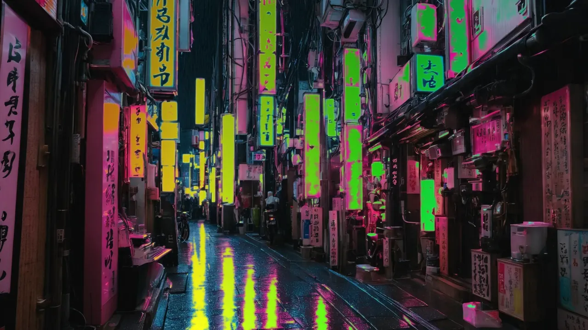

<div align="center">


[](https://github.com/Delido/signalrgb-wallpaper/releases/latest)
[](https://github.com/Delido/signalrgb-wallpaper/releases)
[](LICENSE)
[](#requirements)
[](https://paypal.me/SMendyka)

### **Live RGB glow on your desktop, driven by your SignalRGB effect.**

Multi-monitor · configurable per screen · one-click installer ·
Lively *and* Wallpaper Engine.

</div>

---

Your SignalRGB effect already drives keyboards, fans and strips —
**why not your desktop too?** This project lets the live colours from
SignalRGB shine through transparent regions of your wallpaper. Pick any
image, carve cut-outs into it (or use one of the bundled starters), and
the holes light up in whatever colour your current SignalRGB effect is
producing — in real time, 60 fps, with zero noticeable CPU cost.

Runs on top of [Lively Wallpaper](https://www.rocksdanister.com/lively/)
(free) or [Wallpaper Engine](https://www.wallpaperengine.io/) (paid, on
Steam). The one-click installer sets everything up — no Python, no
manual file copies, no terminal.

<div align="center">



*42 ready-to-go wallpapers in the bundled library, both 1080p and 4K
— see the v1.7.5-beta highlights below.*

</div>

## v1.7.5-beta highlights

- **38 new bundled wallpapers** — cyberpunk, synthwave, aurora,
  underwater, sci-fi. Each ships in **1080p AND 4K** with
  saliency-cut alpha so the SignalRGB glow shines through neon
  zones. Generated locally with Juggernaut XL v9 (CreativeML Open
  RAIL++-M — output is unencumbered, see [docs/credits.md](docs/credits.md)).
- **Library tab redesign** — search, sort, tag chips, category
  filter (background / template / both), one-click apply, right-
  click context menu with Tag-Picker dialog, per-screen apply, per-
  span-tile apply ("links / rechts"), "Apply in 4K" override.
- **ETag-based cache busting** — regenerated thumbs propagate to
  the Configurator on the next render, no hard refresh needed.
- **Builder Apply Wall fallback** — leaving a tile empty no longer
  wipes the existing background underneath; the untouched half
  survives.
- **Smaller installer per-image** — saliency-cut WebP at quality 88
  saves ~85 % over PNG with the soft-mask gradients intact.

> 🎯 **v1.3.0 is the current stable.** v1.4 + v1.5 betas open the
> bridge up to other lighting ecosystems — your wallpaper, your
> OpenRGB hardware, and your DMX/sACN gear can now all run off the
> same SignalRGB effect.
>
> - **OpenRGB output** (v1.4-beta) — bridge talks to OpenRGB's
>   network SDK and mirrors the wallpaper's averaged glow colour
>   onto every OpenRGB-controlled device (RAM, fans, keyboards, …).
>   Custom MIT-safe SDK client, opt-in, disabled by default.
> - **Per-screen colour source** (v1.5-beta) — each screen can take
>   its glow colour from SignalRGB (default), an OpenRGB device, or
>   an incoming sACN/E1.31 universe. Lets a wallpaper follow
>   whichever effect engine you actually run.
> - **sACN / E1.31 output** (v1.5-beta) — streams the per-screen
>   glow as DMX-over-IP on the standard multicast group. Receivers:
>   xLights, QLC+, Hyperion, any hardware DMX / sACN controller.
> - **Spatial mapping** (v1.5-beta) — drag each OpenRGB device's
>   marker on a live wallpaper preview to tell the bridge where in
>   the wallpaper to sample its colour from. Each device gets the
>   colour at its own position, not a mushed global average.
>
> Earlier highlights from the v1.2.x → v1.3.0 line (current stable):
>
> - **Monitor-Setup workflow** in the Builder — declare ultrawide-as-
>   2-monitors or landscape+portrait span layouts, edit each sub-tile
>   independently, "Apply Wall" composites one PNG per bridge screen
>   with portrait tiles rotated automatically.
> - **Quick Looks gallery** — 10 pre-built bundles (Streamer, Focus,
>   Pomodoro, Minimal Productivity, Gaming, …) that swap effects +
>   widget layout in one click without touching the background.
> - **Live preview iframe** in the Configurator — see widgets,
>   ambient effect, and glow on a scaled-down WYSIWYG canvas.
> - **Per-tab settings popover** with visual layout picker for
>   monitor declarations + Mirror mode + Reset.
> - **System section** absorbs the tray's old Advanced submenu
>   (preset hotkeys, fullscreen pause, update channel, reload pages,
>   re-import bundles, diagnostics export).
> - **RSS widget**, **video backgrounds** (mp4 / webm / mov),
>   **bridge-offline standby card**, **WebSocket reconnect backoff**,
>   **MSIX-Lively loopback fix**.
>
> Full release notes in the [CHANGELOG](CHANGELOG.md).

## What you get

- 🌈 **Live RGB glow** behind a transparent background, 60 fps
- 🖥️ **Up to 4 bridge screens**, each independent, mirroring, or
  declared as a multi-monitor span (ultrawides, landscape+portrait
  pairs)
- 🖌️ **In-browser image editor** — pick any wallpaper, click out
  transparent regions, Auto-Cut for one-click bright-region detection,
  reference-image colour picker, full keyboard nav
- 🎨 **Starter wallpaper library** — 42 bundled, AI-generated
  wallpapers spanning cyberpunk, synthwave, aurora, underwater
  and sci-fi (1080p + 4K variants per slug). Add your own via
  *Add image…* or carve cut-outs in the Builder.
- 🎬 **Video backgrounds** — MP4 / WebM / MOV / M4V routed through
  a `<video>` element so animated wallpapers work out of the box
- ⚙️ **Browser-based Configurator** — change background, glow,
  effects, widgets on-the-fly without restarting anything; live
  WYSIWYG preview iframe
- 🎯 **Quick Looks** — 10 pre-built bundles (Streamer, Focus,
  Pomodoro, Minimal Productivity, Gaming, …) — one-click swap of
  effects + widgets without touching your background
- ✨ **Ambient effects** behind the wallpaper — snow, rain, sparks,
  aurora, vortex, plus a whole-screen audio-reactive glow layer
- 🧩 **12 desktop widgets** — clock, calendar, weather, sticky notes,
  countdowns, photo frame, quote of the day, CPU / RAM / network
  meters, hardware sensor, audio spectrum, now-playing, **RSS feed**
- 💾 **Preset slots** — save a complete "background + glow + widgets"
  combo per screen, switch with one click. Quick Looks auto-snapshot
  to slot 1 before they apply, so you can always revert.
- 🌐 **DE / EN UI**, auto-detected from your Windows locale
- 🎮 **Auto-pause** when a fullscreen app is active — no GPU drain
  during games
- 🩺 **Diagnostics export** — one-click ZIP with config, library,
  and summary metadata for bug reports
- 🔌 **LED ecosystem hub** *(v1.4 / v1.5 beta)* — per-screen colour
  source picker (SignalRGB / OpenRGB / sACN-E1.31), parallel
  outputs to OpenRGB hardware + DMX/sACN receivers (xLights /
  QLC+ / Hyperion / hardware DMX nodes), and a drag-to-position
  live-preview editor so each OpenRGB device follows the colour at
  its own spot on the wallpaper. All opt-in, disabled by default.

## See it in action

| Configurator | Wallpaper builder |
| :---: | :---: |
|  |  |
| *Pick a background from the bundled library or your own image, dial in glow strength, ambient effects and widgets — everything live in your browser.* | *Click any colour to make it transparent. Drag rectangles, polygons or ellipses. Soft brushes for fine control. Apply straight to a screen with one click.* |

| SignalRGB integration | Wallpaper Engine |
| :---: | :---: |
|  |  |
| *The plugin announces 1–4 "Desktop Wallpaper – Screen N" devices in SignalRGB. Aspect Ratio = Auto matches each monitor's real shape (ultrawide-friendly).* | *One Workshop-style bundle assigned to every monitor with a different **Screen index** per assignment. No manual canvas tricks needed.* |

## Quick start

### 1 · Install

> 📸 **Step-by-step walkthrough with screenshots:**
> [docs/installation.md](docs/installation.md#installer-walkthrough)

**Fastest path — winget:**

```powershell
winget install Delido.SignalRGBWallpaper
```

That pulls the latest signed installer from GitHub Releases and
runs it with the default options. Everything below applies — you
just skip the manual download step.

**Manual download:**

1. Grab `SignalRGBWallpaperSetup-<version>.exe` from
   [Releases](https://github.com/Delido/signalrgb-wallpaper/releases/latest).
2. Run it. **No admin needed** — installs per-user. The wizard's
   defaults match the most common path (Lively + auto-import + SignalRGB
   plugin + autostart + open the Configurator when done).
   - 🟢 **No Lively installed yet?** Tick *Auto-install Lively if not
     already present* and the installer downloads + silently installs
     the latest Lively from GitHub before importing the wallpapers.
   - 🟢 **Wallpaper Engine on Steam?** Auto-detected; the bundle goes
     straight into WE's *My Wallpapers*.

### 2 · Configure

After install, the Configurator opens automatically in your browser
at `http://127.0.0.1:17320/configurator`. Set the screen count
(top right, *Screens: 1 / 2 / 3 / 4*), pick a starter wallpaper
from the library strip, tweak the glow strength, optionally turn on
an ambient effect — done.

**Performance levers (Configurator → Glow card):**

- **Grid renderer**: *DOM* (default, cheapest on GPU — best for
  RTX-class hardware) or *Canvas* (lower CPU, slight GPU bump —
  best for weaker CPUs running heavy SignalRGB effects like
  Crystal Glow).
- **Glass quality**: *Medium* (default, 6 px backdrop-blur on
  Glass-tile widgets), *Low* (no blur — biggest GPU win when you
  have many Glass widgets), or *High* (12 px blur — pre-v1.2.12
  visual quality, GPU-heavy).

### 3 · Place SignalRGB devices

Open SignalRGB → **Layouts**. Drag each *Desktop Wallpaper – Screen N*
device onto the canvas where you want colours sampled from. For a
single monitor: cover the canvas. For two side-by-side monitors: left
half + right half. The [Help page](#help) and
[multi-screen guide](docs/multi-screen-setup.md) have worked examples.

### 4 · Assign in your wallpaper host

- **Lively users** — the installer dropped the four wallpapers into
  your Lively library. Right-click each *SignalRGB Glow – Screen N*
  tile → *Set as wallpaper* → pick the matching monitor.
- **Wallpaper Engine users** — open WE, *My Wallpapers* now contains
  *SignalRGB Glow*. Assign it to every monitor you want to drive,
  and in each per-wallpaper *Properties* panel pick a different
  *Screen index* (Screen 1 / 2 / 3 / 4).

> 💡 **Stuck or unsure which setup matches your monitors?** Right-
> click the bridge's tray icon → **Help…** for scenario walkthroughs
> (1 / 2 / 3 / 4 monitors × Lively / Wallpaper Engine, ultrawide,
> common pitfalls — all DE / EN).

## Requirements

- **Windows 10 or 11**
- **[SignalRGB](https://www.signalrgb.com/)** installed and able to drive
  your hardware (open it once, pick any effect; if no LEDs light up,
  fix that first)
- **A wallpaper host** — at least one:
  - **[Lively Wallpaper](https://www.rocksdanister.com/lively/)** —
    free, recommended. GitHub-installer build preferred; Microsoft Store
    / MSIX build also works. If you don't have Lively yet, the installer
    can fetch + install it for you.
  - **[Wallpaper Engine](https://www.wallpaperengine.io/)** — paid,
    on Steam. Auto-detected by the installer; one combined bundle gets
    dropped into `wallpaper_engine\projects\myprojects\`.

## Help

The tray icon's **Help…** entry opens a scenario-based walkthrough
covering every Lively / Wallpaper Engine setup for 1–4 monitors,
including ultrawide / non-16:9 panels and spanned configurations
(DE / EN, auto-localised). For docs beyond the in-app help:

- **[Installation guide](docs/installation.md)** — full installer
  walkthrough with screenshots and Windows path notes
- **[Multi-screen setup](docs/multi-screen-setup.md)** — placing
  SignalRGB devices on the canvas, assigning wallpapers per monitor
- **[Building glow wallpapers](docs/building-wallpapers.md)** —
  picking a source image, GIMP workflow, what looks good
- **[Tray reference](docs/tray-settings.md)** — every menu entry
  explained
- **[Troubleshooting](docs/troubleshooting.md)** — when things don't
  work
- **[Architecture](docs/architecture.md)** — wire formats, threading
  model, why the components are split the way they are
- **[Build from source](docs/building-from-source.md)** —
  PyInstaller + Inno Setup, dev loop

## How it works

The SignalRGB plugin registers as virtual lighting devices (one per
monitor) and samples your effect canvas every frame. Each frame goes
out as a UDP datagram to a small **bridge** (`SignalRGBBridge.exe`,
runs in your tray) that fans the colours out to one HTML wallpaper page
per monitor over WebSocket. The wallpaper page renders the colours as a
CSS-grid glow layer behind your background image. All per-screen
settings (background, glow, widgets, effects) live in the **in-browser
Configurator** which pushes changes live to the wallpaper without any
reload. Full architecture: [docs/architecture.md](docs/architecture.md).

## Manual install (no installer)

If you'd rather not run the installer:

| File | Where it goes |
| --- | --- |
| `SignalRGBBridge.exe` | Anywhere stable (e.g. `C:\Tools\SignalRGBWallpaper\`) |
| `SignalRGB_Desktop_Wallpaper.js` + `.qml` | `Documents\WhirlwindFX\Plugins\` |
| `SignalRGB_Glow_Screen{1,2,3,4}.zip` *(Lively)* | Drag each zip onto Lively |
| `SignalRGB_Glow_WE_Single.zip` *(Wallpaper Engine)* | Extract; drop `signalrgb-glow/` into `…\steamapps\common\wallpaper_engine\projects\myprojects\` |

Then run `SignalRGBBridge.exe`. The tray icon appears; right-click
→ *Configurator…* to set everything up.

## Uninstall

Windows Settings → **Apps** → SignalRGB Desktop Wallpaper → Uninstall.
The uninstaller removes the bridge, the auto-imported Lively folders
(`signalrgb-glow-screen-{1..4}\`), the WE bundle (`signalrgb-glow\`),
and the autostart registry entry. Your custom backgrounds, widgets and
presets in `%LOCALAPPDATA%\SignalRGBWallpaper\` stay; delete that folder
by hand to clear them too.

The SignalRGB plugin in `Documents\WhirlwindFX\Plugins\` is **not**
removed automatically — delete by hand if you want SignalRGB to forget
about it.

## What's new

**v1.4 → v1.5 beta line: LED ecosystem hub.** The bridge stops
being SignalRGB-only on both ends — each screen picks its colour
source independently, and the same averaged glow streams out to
OpenRGB + sACN/E1.31 receivers in parallel.

- 🔌 **OpenRGB output channel** *(v1.4.0-beta)* — pure-Python
  MIT-safe SDK client connects to OpenRGB's network server on
  `127.0.0.1:6742` and pushes the wallpaper glow onto every
  enumerated device at 30 Hz. Off by default; opt in from the
  Configurator's System card.
- 🎛 **Per-screen colour source picker** *(v1.5.0-beta)* — each
  screen can take its glow from SignalRGB UDP (default), an
  OpenRGB device (bridge polls its LEDs), or an incoming
  sACN/E1.31 multicast universe (first three DMX channels =
  R/G/B).
- 📡 **sACN / E1.31 output** *(v1.5.0-beta)* — streams the
  per-screen glow as DMX over IP. Multicast (standard) or
  unicast (specific receiver), per-screen universe assignment,
  priority 0–200. Receivers: xLights, QLC+, Hyperion, any
  hardware DMX / sACN controller.
- 🎯 **Spatial mapping for OpenRGB output** *(v1.5.0-beta)* —
  drag each device's marker on a 480×270 live wallpaper preview
  to tell the bridge where in the wallpaper to sample its
  colour from. Lets RAM on the left of the screen match the
  left half of the wallpaper, fans on the right match the
  right, etc. — instead of one averaged colour for everything.

**v0.9.x** is the current beta cycle and rolls up the bigger
post-v0.8 features — automation, more effects, and a much-improved
multi-monitor Builder workflow. Highlights since v0.8.0:

### Automation / convenience

- 🆕 **Wallpaper auto-cycle** — per-screen *Auto-cycle* block in
  the Background card, configurable interval / pool / order
  (v0.9.2-beta)
- 🆕 **Preset hotkeys** — global `Ctrl+Shift+1..4` swap presets
  on every active screen, toggle under tray → Advanced
  (v0.9.3-beta)
- 🆕 **Per-app / per-game profiles** — foreground-window watcher
  auto-switches presets when a specific exe runs; snapshots
  prior state and reverts on focus-out (v0.9.5-beta)
- 🆕 **Now-playing widget** — Windows SMTC; title + artist +
  optional progress bar, glow-tinted (v0.9.4-beta)
- 🆕 **In-app auto-update** — tray downloads and runs the new
  installer silently; tray button replaces the "go to releases
  page" prompt (v0.9.8-beta)

### Builder / Monitor Wall

- 🆕 **Monitor Wall** as primary right-panel nav — one tile per
  monitor, click drops in file / library / current canvas
  (v0.9.11-beta)
- 🆕 **⇔ Span canvas across monitors** — single click slices the
  current canvas into one chunk per screen, sized to each
  monitor's physical width; closes the merge → wall workflow
  gap for the *photos side-by-side → 7680×2160 → onto 2 ×
  2560×1440* flow (v0.9.13-beta)
- 🆕 **Right-panel rework** — Source → Wall → Output flow,
  Merge collapsed by default, Apply Wall full-width primary
  (v0.9.14-beta)
- 🆕 **Auto cut tool** ✨ — one-click detection of bright /
  salient regions for cutting. Two pure-JS modes: **Auto
  saliency** (Achanta-2009 frequency-tuned algorithm) and
  **Brightness (Otsu)**, both ~50 ms, offline, no model
  download, no licence concerns. Power users can opt into a
  custom ONNX model via `localStorage` if they want
  (v0.9.16 → v0.9.20)

### Effects + UI

- 🆕 **5 new ambient effects** — Constellation, Fireflies
  (v0.9.12-beta) plus Plasma, Vortex, Bubbles (v0.9.15-beta).
  All written from scratch in the project's `AMBIENT_PRESETS`
  shape, no per-pen licence verification needed.
- 🆕 **First-run onboarding tour** — Configurator-side overlay
  with 7 steps, spotlight ring + tooltip on the live DOM;
  *Tour* button in the header replays (v0.9.10-beta)
- 🆕 **Ctrl+Z undo across settings** — per-screen ring buffer,
  20 entries (v0.9.10-beta)
- 🆕 **Setup health-check + Backup/Restore + Reset-screen** —
  tray *System status…* dialog and Configurator *Backup &
  Restore* card (v0.8.9-beta)
- 🆕 **Mirror mode per tab** — any screen can mirror any other;
  invariant enforced via `_block_if_mirror` /
  `_replicate_to_mirrors` (v0.8.8-beta)

### Bug fixes from the 0.8.x / 0.9.x cycle

- 🐛 **Perf**: SignalRGB-startup lag fixed by coalescing 5×
  redundant `applyZoneSize` rebuilds into one (v0.8.1)
- 🐛 **Installer**: library.json no longer overwritten on
  upgrade — your uploads survive (v0.8.6-beta)
- 🐛 **Tray auto-update**: three-step debugging — `subprocess.
  Popen + DETACHED_PROCESS` → `ShellExecuteW` (v0.9.17) →
  `CloseApplications=force` in the Inno script (v0.9.19) to
  stop the silent installer deadlocking on a user-confirm
  dialog that's already been killed by `/SUPPRESSMSGBOXES`.
  Tray *Download + install update* now works reliably

Full version-by-version breakdown: [CHANGELOG.md](CHANGELOG.md).

## Roadmap

Open ideas grouped by impact-to-effort ratio. Pull requests welcome.
For the long-form version with per-item implementation notes +
licence-compatibility guidance, see [docs/roadmap.md](docs/roadmap.md).

> ✅ **All tiers shipped.** Setup health-check, backup/restore,
> Ctrl+Z undo, first-run tour, wallpaper auto-cycle, preset
> hotkeys, per-app profiles, Now-playing widget, Builder Auto-cut
> tool, auto-update, twelve ambient effects, multi-monitor wall
> workflow, Winget submission — Tiers 1+2+3 done across the v0.8
> → v1.3 line. **Tier 4 (LED-ecosystem + integration)** shipped
> in v1.4 + v1.5: OpenRGB output, per-screen colour-source picker
> (SignalRGB / OpenRGB / sACN), sACN/E1.31 input + output, sACN
> universe discovery, spatial mapping for OpenRGB output (point
> and strip mode), HA / MQTT bridge with Discovery, REST API
> with OpenAPI + bearer-token auth, generic HTTP widget, plugin
> API for 3rd-party widgets.

### What might come next

Honest answer: the roadmap is done. The bridge does a lot.
Realistic follow-ups are user-driven from here:

- **Cosmetic polish + Configurator UX iteration** — the v1.4 / v1.5
  features all have basic UI; some of them deserve nicer cards,
  better discoverability, and inline docs.
- **More plugin examples + a contrib library** — the plugin API is
  in place, plugins themselves are out-of-tree. A small starter
  set (`weather-pro`, `home-assistant-monitor`, …) in a separate
  repo would lower the on-ramp.
- **Per-LED freeform mapping** (post-line follow-up) — let the user
  individually place every LED of a device on the wallpaper
  instead of point/line presets. Niche, only matters for
  irregular hardware layouts.

Got a wish that isn't here?
[Open an issue](https://github.com/Delido/signalrgb-wallpaper/issues/new)
and tag it `enhancement`.

## Contributing

Issues and PRs welcome. Bug reports should include:

- Windows version (Win+R → `winver`)
- SignalRGB version (Settings → About in SignalRGB)
- Lively / Wallpaper Engine version — say which one + Microsoft Store
  vs GitHub build for Lively
- The bridge log if relevant: run `SignalRGBBridge.exe` from a CMD
  window (or `python wallpaper_bridge\bridge.py` directly)

## Support / donate

This project is built and maintained in spare time. If it saves you
the hassle of writing your own SignalRGB → wallpaper plumbing, or
if seeing a glow that matches your effect just makes you smile every
morning, a small tip keeps the motivation up.

<div align="center">

[](https://paypal.me/SMendyka)

</div>

Issues, feature requests and pull requests are also very welcome —
even just an [issue](https://github.com/Delido/signalrgb-wallpaper/issues)
saying "this is broken on my machine" helps a lot.

## License

[MIT](LICENSE) © 2026 Sebastian Mendyka ([@Delido](https://github.com/Delido))
