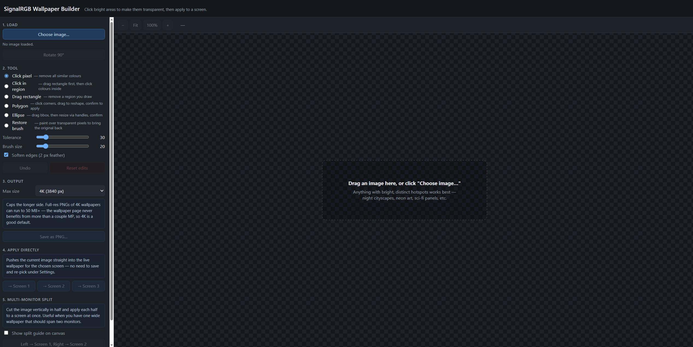
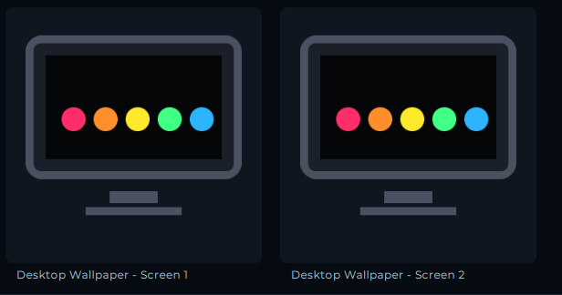
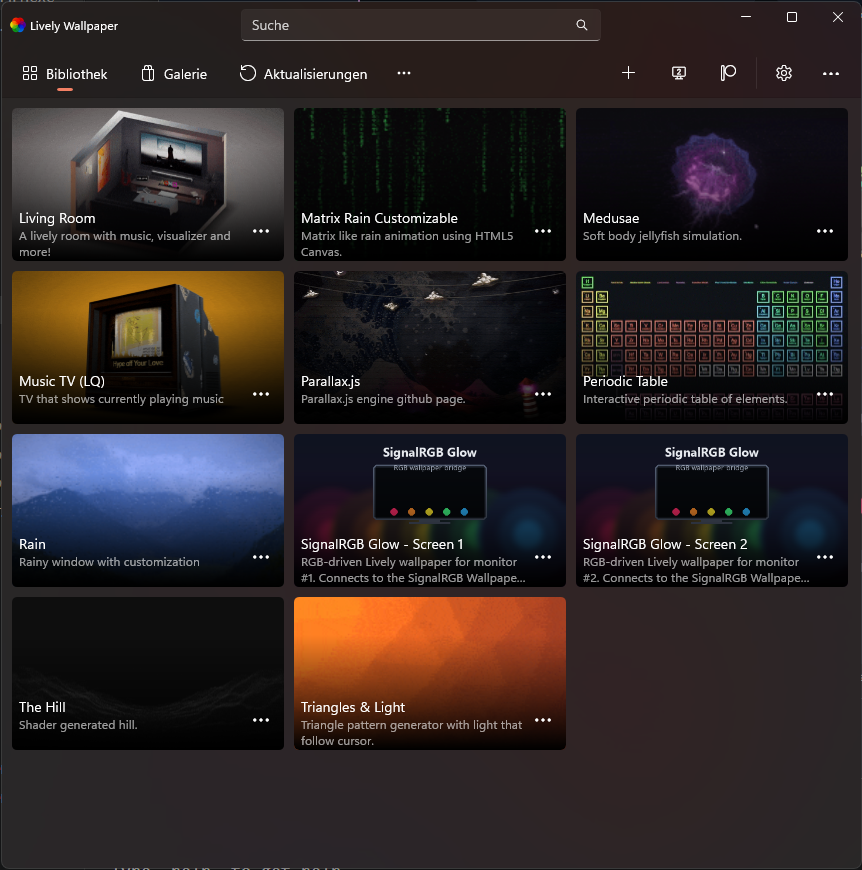
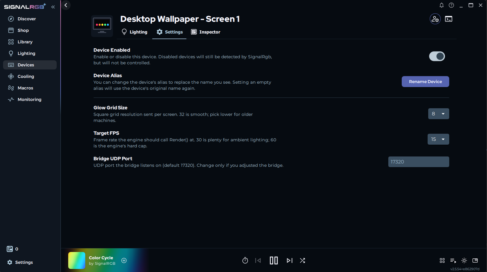

**Live RGB glow on your desktop, driven by your SignalRGB effect.**
Multi-monitor, fully configurable, with an in-browser wallpaper builder
and a one-click installer.

---

Use your current SignalRGB effect as a glow layer on your desktop wallpaper.
Up to **4 monitors**, each configurable separately. Renders inside
[Lively Wallpaper](https://www.rocksdanister.com/lively/) as a regular Web
wallpaper — no proprietary host, no custom shaders.

The principle: a PNG with **transparent cut-outs** (windows, signs, neon
strips, whatever) sits on top of a coloured glow layer. The glow comes
from the live SignalRGB canvas, so anything you cut transparent shines in
whatever colour your current effect is producing right now.

> **Status:** v0.8.0 — first stable after the long 0.7.x beta cycle.
> Rolls up everything: in-browser Help page with scenario
> walkthroughs (tray → _Help…_), Configurator + Builder + Help all
> DE / EN, auto-Lively bootstrapper, single-bundle Wallpaper Engine
> with _Screen index_ property, 4-monitor support, ultrawide
> aspect-ratio handling, whole-screen audio-reactive glow layer,
> per-screen preset slots, pattern-fill brush, wallpaper library
> with upload + delete.
> Brings the full in-browser **configurator** (per-screen tabs,
> drag-and-resize layout preview, snap-to-grid), 11 widget types
> (clock / calendar / weather / sticky note / countdown / picture / quote /
> CPU / RAM / audio spectrum), full-canvas ambient effects
> (snow / rain / sparks / aurora), cursor pixelfx (trail / hover-glow /
> click-ripple), **3D parallax** on the background image, **DE / EN**
> localisation, Wallpaper Engine packaging alongside Lively, an
> **auto-importing** installer (no more manual zip-drag after updates),
> **chunked UDP** for 64 × 64 / 128 × 128 grids, and an in-app GitHub
> update checker.

## Features

- 🌈 **Live RGB glow** behind a transparent background image, 60 fps target
- 🖥️ **1–4 monitor support** with independent settings per screen
- 🎚️ **System tray dialog** for everything: background per screen, glow
  layout (pixel grid / stripes / pills / off), strength, dim, blur — live apply
- 🖌️ **In-browser wallpaper builder** (`Build Wallpaper…` in tray) for
  carving transparent regions out of any image. Color-click, drag-region,
  polygon, ellipse, "click in region", and a **restore brush** to undo
  over-aggressive edits. Apply straight to a screen with one click, or
  save as PNG. Multi-monitor split halves an image across two screens.
- 🎮 **Auto-pause** when a fullscreen app (game, video, RDP) is active —
  glow freezes, CPU is saved, resumes within a second when you alt-tab
  out. Toggle in tray Settings.
- 📦 **One-click installer** (`SignalRGBWallpaperSetup-*.exe`, per-user,
  no admin) handles the bridge, the SignalRGB plugin, the Lively zips,
  autostart, and an Add/Remove Programs entry.
- 🔌 **Standalone bridge** as a single `.exe` (no Python required for users)
- 📡 **Stable wire protocol** — UDP from plugin to bridge, WebSocket
  from bridge to wallpaper, well-defined frame format

## Gallery

<!-- markdownlint-disable MD013 -->

| | |
| :---: | :---: |
|    _**In-browser builder** — click colours to make them transparent, drag rectangles / polygons / ellipses, restore-brush over mistakes, save or apply straight to a screen_ |    _**SignalRGB device list** — one virtual "Desktop Wallpaper" device per monitor, all under a single plugin_ |
|    _**Lively library** — branded tile thumbnails so you can find the wallpapers among everything else you've imported_ |    _**SignalRGB device settings** — grid size, target FPS, bridge port; the canvas placement controls live in SignalRGB's Layouts view_ |

<!-- markdownlint-enable MD013 -->

A short demo video of the builder + a multi-monitor scene would also
be a nice add here — even a 15-second screen recording dropped as a
GIF (`docs/images/demo.gif`) is enough.

## Requirements

- Windows 10/11
- [SignalRGB](https://www.signalrgb.com/) installed and running
- **A wallpaper host** — pick at least one (the installer asks):
  - [Lively Wallpaper](https://www.rocksdanister.com/lively/) (free,
    recommended) — **GitHub installer build** preferred; the Microsoft
    Store / MSIX build also works for Web-type wallpapers
  - [Wallpaper Engine](https://www.wallpaperengine.io/) (paid, on
    Steam) — auto-detected by the installer; the single combined
    `signalrgb-glow/` bundle gets dropped straight into Steam's
    `wallpaper_engine\projects\myprojects\` and is assigned once per
    monitor with a different _Screen index_ per assignment.

## Quick start

### Easy path: installer

> **Step-by-step walkthrough with screenshots:**
> [docs/installation.md#installer-walkthrough](docs/installation.md#installer-walkthrough)

1. Grab `SignalRGBWallpaperSetup-<version>.exe` from
   [Releases](https://github.com/Delido/signalrgb-wallpaper/releases).
2. Run it. No admin needed — installs per-user into
   `%LOCALAPPDATA%\Programs\SignalRGBWallpaper\`. On the Tasks page:
   - **Wallpaper host:** check **Lively** (default) and/or **Wallpaper
     Engine**. Lively-only and WE-only setups both work; only the
     selected host's files get copied. If Lively isn't installed yet,
     the installer can download + silent-install it for you.
   - **Install SignalRGB plugin** (recommended) — drops the plugin
     into `Documents\WhirlwindFX\Plugins\` so SignalRGB can drive the
     bridge.
   - **Start bridge automatically on logon** (recommended).
   - **Open the Configurator when done** — pops the browser UI
     straight after install so you can pick a background image.
3. **Lively users**: the installer opens the _Lively wallpapers_
   folder at the end — drag `SignalRGB_Glow_Screen1.zip` (and
   `Screen2.zip` / `Screen3.zip` / `Screen4.zip` for additional
   monitors) onto Lively to import them, then right-click → _Set as
   wallpaper_ on each monitor.
4. **Wallpaper Engine users**: if Steam + Wallpaper Engine were
   detected the bundle is already in WE's library — open Wallpaper
   Engine, find **SignalRGB Glow** under _My Wallpapers_, and assign
   the same wallpaper to every monitor you want to drive. For each
   assignment open its properties panel and pick a different _Screen
   index_ (Screen 1 / 2 / 3 / 4) so the bridge sends the matching
   SignalRGB device's colours. If Steam wasn't detected the installer
   opens the _Wallpaper Engine wallpapers_ staging folder; drop the
   `signalrgb-glow` folder into Steam's
   `…\steamapps\common\wallpaper_engine\projects\myprojects\` by hand.
5. Right-click the bridge's tray icon → **Configurator…** (the default
   action). In the browser: per-screen tabs at the top → use the
   _Screens:_ picker (top-right of the tab bar) to set how many
   monitors you want to drive, then per tab pick a background image,
   tweak glow layout / strength, place widgets via drag-and-resize,
   switch on an ambient effect, etc.
6. In SignalRGB: place the **Desktop Wallpaper - Screen N** devices
   on SignalRGB's canvas at the positions you want colours sampled
   from. (Layouts → drag the devices.) Optionally raise _Glow Grid
   Base Size_ in the plugin settings up to `128` — anything > 36 uses
   the bridge's chunked-UDP transport automatically.

> **Stuck or unsure which setup matches your monitors?** The tray
> icon also has a **Help…** entry — a scenario-based walkthrough for
> 1 / 2 / 3 / 4 monitor setups with both Lively and Wallpaper Engine,
> plus a Tips section for common pitfalls (DE / EN).

Uninstall via Windows Settings → Apps, or run `unins000.exe` in the
install folder. The uninstaller also removes the three Steam-side WE
bundle folders it placed (leaves any other Wallpaper Engine wallpapers
alone).

> 💡 After updating to a new version, **re-import the Lively zips**
> in Lively (right-click the wallpaper in Lively's Library →
> _Customise / Delete_, then drag the new zip onto Lively). Lively
> caches the extracted HTML from your first import and won't pick up
> new widget / effect code otherwise. Wallpaper Engine just sees the
> new files automatically on next refresh.

### Manual path

If you'd rather not run an installer, grab the individual artefacts
from the same release page and place them yourself:

| File | Where it goes |
| --- | --- |
| `SignalRGBBridge.exe` | Anywhere stable (e.g. `C:\Tools\SignalRGBWallpaper\`) |
| `SignalRGB_Desktop_Wallpaper.js` + `.qml` | `Documents\WhirlwindFX\Plugins\` |
| `SignalRGB_Glow_Screen{1,2,3}.zip` _(Lively)_ | Drag the zip(s) into Lively |
| `SignalRGB_Glow_WallpaperEngine.zip` _(WE)_ | Extract; drop each of the three `SignalRGB_Glow_ScreenN/` folders into `…\steamapps\common\wallpaper_engine\projects\myprojects\` |

Then run `SignalRGBBridge.exe` and proceed with steps 5–6 above
(open the Configurator from the tray, place SignalRGB devices on
the canvas).
Full step-by-step with screenshots: [docs/installation.md](docs/installation.md).

## Documentation

- [Installation guide](docs/installation.md) — the long version of the
  quick start, with screenshots and Windows path notes
- [Tray settings reference](docs/tray-settings.md) — what every slider
  and dropdown does
- [Multi-screen setup](docs/multi-screen-setup.md) — placing devices on
  the SignalRGB canvas, assigning Lively wallpapers to monitors
- [Building glow wallpapers](docs/building-wallpapers.md) — picking a
  source image, GIMP workflow to cut transparent regions, what looks good
- [Troubleshooting](docs/troubleshooting.md) — when the wallpaper stays
  black, when SignalRGB doesn't show the device, when the tray dies
- [Architecture](docs/architecture.md) — wire formats, threading model,
  why the components are split the way they are
- [Building from source](docs/building-from-source.md) — PyInstaller
  build, packaging the Lively zips, dev loop

## How it works (one paragraph)

The SignalRGB plugin registers as a virtual network device, samples
SignalRGB's effect canvas every frame, and sends each frame as a UDP
datagram to `127.0.0.1:17320` with a screen-index byte. The bridge
(`SignalRGBBridge.exe`) listens on UDP 17320 and runs a WebSocket server
on the same port. The Lively wallpaper is an HTML page that connects to
`ws://127.0.0.1:17320/?screen=N` and renders the received colours as a
CSS-grid glow layer behind a transparent background image. The bridge
also hosts a tray icon for per-screen settings (background image, layout,
glow strength, etc.) which it pushes live to the wallpaper page over the
same WebSocket. Full architecture: [docs/architecture.md](docs/architecture.md).

## Roadmap

Loose, unordered list of things on the "would be nice" pile. No commitments
on timing — pull requests and votes (👍 on the matching issue) welcome.

### Planned

_(nothing currently planned — the formerly-tracked items all shipped
in the 0.7.x beta cycle. Have a wish? Open an
[issue](https://github.com/Delido/signalrgb-wallpaper/issues/new)
and tag it `enhancement`.)_

### Recently shipped

- ✅ **In-browser Help page** — scenario-based walkthrough for
  1 / 2 / 3 / 4 monitors × Lively / Wallpaper Engine, plus an
  ultrawide section and a Tips & common pitfalls block. Tray icon
  → _Help…_ entry, DE / EN auto from `/config` (0.7.11-beta)
- ✅ **WE audio fixed** — `supportsaudioprocessing: true` is now
  inside `general` in `project.json` where WE actually honours it.
  Audio glow layer + audio-spectrum widget receive FFT samples
  under WE (0.7.10-beta)
- ✅ **Auto-Lively bootstrapper** — when the user kept the opt-in
  task AND no Lively install was detected, the installer downloads
  and silently installs the latest Lively from GitHub Releases
  before copying our bundles. Bundled PowerShell helper, no Inno
  Download Plugin dependency (0.7.8-beta)
- ✅ **Library: add + delete from the Configurator** — Add image…
  button + per-tile hover delete corner. Bridge gains
  `POST /library/upload` + `DELETE /library/<file>`; catalogue
  rebuilds automatically (0.7.8-beta)

- ✅ **Pattern-fill brush in the Builder** — new tool: halftone /
  dither (Bayer 8×8) / hatching transparent cuts. Scale, density and
  angle controls per pattern. Tiles continuously across stamps
  (coordinates are canvas-absolute) (0.7.7-beta)
- ✅ **Wallpaper library** — installer ships four procedurally
  generated starter wallpapers under
  `%LOCALAPPDATA%\SignalRGBWallpaper\library\`. Configurator's
  Background section gets a thumbnail strip; click → applies to the
  active screen via `POST /screen/N/background`. Users can drop
  their own PNGs into the same folder (0.7.7-beta)
- ✅ **Per-screen preset slots in the Configurator** — four slots
  per screen, each saving a snapshot of background + glow + dim +
  blur + ambient + pixelfx + parallax + audio glow + widgets (with
  positions / options). New WS commands `preset-save` / `apply` /
  `clear`. Slot rows show a short summary (widget count, layout,
  active effects) (0.7.7-beta)
- ✅ **Whole-screen audio-reactive glow layer** — Pulse / Spectrum
  bars / Waveform modes driven by the same FFT feed the audio-spectrum
  widget uses. Mix-blend-mode: screen so it stacks on the existing
  glow instead of replacing it. Tint-with-glow toggle to match the
  live colour (0.7.5-beta)
- ✅ **Configurator owns _Number of screens_ + debug overlay** —
  both knobs moved from the legacy Tk dialog into the in-browser
  Configurator. The Tk dialog tray entry is gone; the dialog code
  stays in the source as dormant fallback (0.7.4-beta)
- ✅ **Builder is DE / EN** — all labels, tooltips and toast
  messages localised. Language is pulled from the bridge's
  `GET /config` endpoint on load (0.7.4-beta)
- ✅ **Single Wallpaper Engine bundle** — installer copies one
  `signalrgb-glow/` folder instead of four per-screen folders;
  subscribers assign once per monitor and pick a different
  _Screen index_ per assignment (0.7.2-beta), with installer
  auto-clean of legacy per-screen folders on upgrade (0.7.3-beta)
- ✅ **Ultrawide-friendly glow grid** — plugin gained an
  _Aspect Ratio_ dropdown (Auto / 1:1 / 16:9 / 21:9 / 32:9 / 9:16 /
  Custom). Auto reads each monitor's viewport via the bridge's
  `/config` `screens[]` sidecar; 3840 × 1080 panels now get a non-
  square grid that actually matches their shape (0.7.1-beta)
- ✅ **4-monitor support** — bridge / plugin / installer /
  Configurator / Builder all lifted from `MAX_SCREENS = 3` to `4`
  (0.7.1-beta)
- ✅ **Lively auto-import** — installer drops `signalrgb-glow-
  screen-{1..N}` straight into Lively's library with deterministic
  folder names, so re-installs overwrite in place instead of
  duplicating tiles (0.7.0)
- ✅ **Chunked UDP transport** — frames > 4 KB are now split across
  multiple datagrams (`SC` magic) and reassembled bridge-side,
  enabling real 64 × 64 / 96 × 96 / 128 × 128 grids (0.6.0-beta /
  0.7.0)
- ✅ **3D parallax** — background image slides against the cursor for
  a fake-depth effect (0.7.0)
- ✅ **DE / EN localisation** — tray menu, About dialog and the
  Configurator all auto-detect the Windows locale; Builder strings
  still pending (0.7.0)
- ✅ **About-dialog overhaul** — maintainer name + GitHub avatar +
  open-source-credits link + tip jar (0.7.0)
- ✅ **Snap-to-grid in the Configurator's layout preview** and a
  top-level _Lock / Unlock widgets_ tray entry (0.7.0)
- ✅ **In-browser configurator** with per-screen tabs, drag-and-
  resize layout preview, prominent lock toggle, form-based widget
  options (0.6.0-beta / 0.6.1-beta)
- ✅ **Ambient effects** (snow / rain / sparks / aurora) with
  glow-tint opt-in (0.6.0-beta)
- ✅ **Pixelfx** — mouse trail, hover glow, click ripple via the
  host's cursor callback (0.6.0-beta)
- ✅ **System-stat widgets** — CPU / RAM sparklines + audio spectrum,
  fed by a `psutil` poller in the bridge (0.6.0-beta)
- ✅ **In-app GitHub update checker** with prerelease-aware semver
  filtering (0.5.1-beta)
- ✅ **Wallpaper Engine support** — bundles built alongside Lively
  zips and auto-copied to Steam's WE projects folder when detected,
  plus a single combined Workshop item with a _Screen index_
  property covering up to 4 monitors (0.5.2-beta → 0.7.1-beta)
- ✅ **Widget framework** with 11 built-in types (clock, calendar,
  weather, sticky note, countdown, picture frame, quote, CPU, RAM,
  audio spectrum, network) and an extensible registry
  (0.5.0 → 0.6.0-beta)
- ✅ **Builder polish** — live brush cursor, hardness slider, round /
  square brush shape, erase brush, drag-and-drop merge slots, full
  undo / redo, _Apply to Screen 1 / 2 / 3 / 4_ buttons (0.4.5 →
  0.7.1-beta)
- ✅ **GIMP-style builder layout** — icon toolbox + tool options +
  canvas + files panel (0.4.5)
- ✅ **Side-by-side image merge** in the builder (0.4.4 / 0.4.5)
- ✅ **GPU-load drop** from ~20 % to ~3 % on the grid layout (0.5.1)

Have a wish that isn't here?
[Open an issue](https://github.com/Delido/signalrgb-wallpaper/issues/new)
and tag it `enhancement`.

## Contributing

Issues and PRs welcome. Bug reports should include:

- Windows version (Win+R → `winver`)
- SignalRGB version (Settings → About in SignalRGB)
- Lively version (Settings → About in Lively) — **say whether it's the
  Microsoft Store or GitHub build**
- The bridge log if relevant: run `SignalRGBBridge.exe` from a CMD
  window (so stdout is visible) or run `python wallpaper_bridge\bridge.py`
  directly

## Support / donate

This project is built and maintained in spare time. If it saves you the
hassle of writing your own SignalRGB → wallpaper plumbing, or if a glow
that matches your effect just makes you smile every morning, a small tip
keeps the motivation up.

Issues, feature requests, and pull requests are also very welcome —
even just an [issue](https://github.com/Delido/signalrgb-wallpaper/issues)
with "this is broken on my machine" helps a lot.

## License

[MIT](LICENSE) © 2026 Delido
