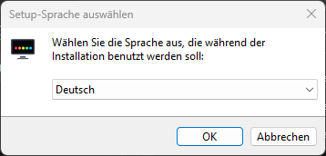
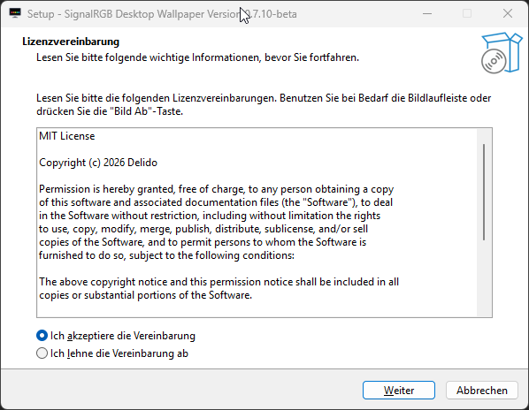
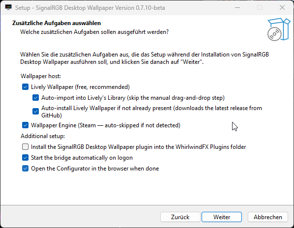
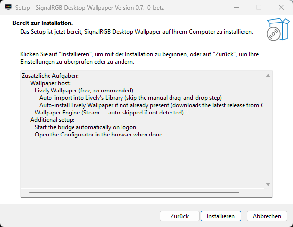
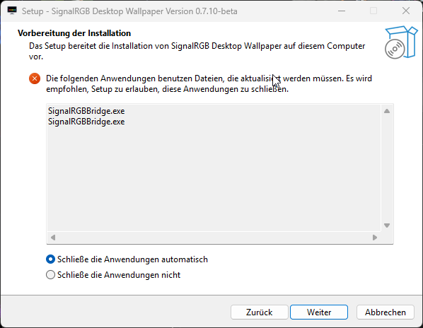
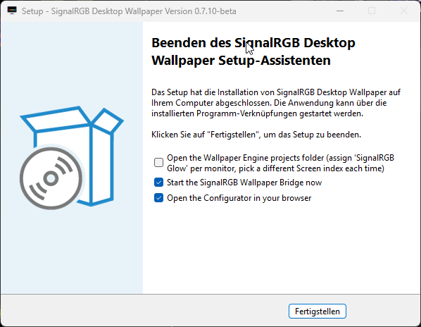

# Installation

The long version of the [README quick start](https://github.com/Delido/signalrgb-wallpaper/blob/main/README.md#quick-start),
with exact paths and the Windows things that trip people up.

## Prerequisites

Confirm these are working before you start:

1. **SignalRGB** — [signalrgb.com](https://www.signalrgb.com/). Open it
   once and pick any effect; if no LEDs light up, fix that first. This
   project rides on top of SignalRGB's effect canvas, so SignalRGB has
   to be functional in the first place.
2. **A wallpaper host** — pick at least one (the installer asks):
   - **Lively Wallpaper** (free, recommended) —
     [rocksdanister.com/lively](https://www.rocksdanister.com/lively/).
     The GitHub installer build is preferred; the Microsoft Store / MSIX
     build also works.
   - **Wallpaper Engine** (paid, on Steam) — auto-detected by the
     installer; bundles get copied straight into Steam's
     `wallpaper_engine\projects\myprojects` folder.
3. **Windows 10 or 11**. No other dependency — the bridge ships as a
   single self-contained `.exe` (Python + Tk + Pillow + psutil + pystray
   all bundled by PyInstaller).

## Easy path: installer

Grab the latest `SignalRGBWallpaperSetup-<version>.exe` from the
[Releases page](https://github.com/Delido/signalrgb-wallpaper/releases/latest)
and run it. No admin needed — installs per-user into
`%LOCALAPPDATA%\Programs\SignalRGBWallpaper\`.

### Installer walkthrough

The wizard is six screens long. Click through them in order — the
defaults are sensible for new installs, and an upgrade run uses the
same defaults so you can mostly just hold Enter.

#### 1. Language

The wizard offers German and English. Pick whichever you prefer — the
rest of the wizard, the tray menu, the About dialog and the
Configurator all follow the same setting after install (the bridge
also re-resolves on launch from your Windows locale unless you set
`"language"` explicitly in `config.json`).

#### 2. License

MIT license, the whole project is open source. Accept and click
*Weiter / Next*.

#### 3. Tasks (the page that does the actual work)

This is the meaty page. Defaults match the most common path
(Lively + auto-import + auto-install Lively if missing + WE
auto-copy when Steam is detected):

**Wallpaper host:**

- ☑ **Lively Wallpaper** (default on) — required for the Lively path.
- ☑ **Auto-import into Lively's Library** (sub-task) — when this
  task and a Lively install (GitHub or MSIX build) are both present,
  the four glow bundles get extracted directly into Lively's
  `Library\wallpapers\signalrgb-glow-screen-{1,2,3,4}\` with
  deterministic folder names. Every subsequent installer run
  overwrites in place — no more *"delete and re-import after every
  update"* dance.
- ☐ **Auto-install Lively Wallpaper if not already present** — *opt-in.*
  When ticked AND Lively isn't on disk, the installer downloads the
  latest release from GitHub and runs it silently *before* the
  auto-import step. Default off because it adds network egress at
  install time and AV / SmartScreen can flag the silent install on
  some setups — tick it only if you actually need Lively installed
  for you. Users who already have Lively (or want to install it
  separately from the MS Store) can leave this off.
- ☑ **Wallpaper Engine** (Steam — auto-skipped if not detected) —
  copies the single combined `signalrgb-glow/` bundle into
  `…\steamapps\common\wallpaper_engine\projects\myprojects\`. You
  assign it once per monitor in WE and pick a different *Screen
  index* per assignment.

**Additional setup:**

- ☑ **Install the SignalRGB Desktop Wallpaper plugin** *(required)*
  — drops `SignalRGB_Desktop_Wallpaper.js` + `.qml` into your
  `Documents\WhirlwindFX\Plugins\` folder. Without this, SignalRGB
  has no way to send colours to the bridge and the whole product
  does nothing. Only uncheck if you're maintaining the plugin file
  by hand (devs only).
- ☑ **Start the bridge automatically on logon** — adds an HKCU
  `Run` registry entry. Standard per-user autostart, no service.
- ☑ **Open the Configurator in the browser when done** — pops the
  in-browser settings UI right after install so you can pick a
  background and start configuring without finding the tray icon
  first.

#### 4. Summary

Quick recap of what's about to happen. Click *Installieren / Install*.

#### 5. (Optional) Close running bridge

Only appears when you're upgrading and the bridge is still running.
Pick *Schließe die Anwendungen automatisch / Close the applications
automatically* and the installer will end the running process before
overwriting it — saves a manual quit + re-run. The bridge can be
auto-restarted at the end of the wizard via the *Start now* checkbox
on the final page.

#### 6. Finish

Two opt-in actions at the end:

- ☑ **Start the SignalRGB Wallpaper Bridge now** — launches
  `SignalRGBBridge.exe` so the tray icon appears immediately. If
  unticked you can also start it via Start menu later.
- ☑ **Open the Configurator in your browser** — pops
  `http://127.0.0.1:17320/configurator` so you can pick a background,
  set glow + widget options, etc.

> A third checkbox shows up only when **Wallpaper Engine was picked
> AND Steam wasn't detected**: *Open the Wallpaper Engine bundle
> folder*. In that case the installer dropped `signalrgb-glow/` into
> `{app}\Wallpaper Engine wallpapers\` instead of Steam's
> `myprojects\`, and you need to drag the folder into Wallpaper
> Engine by hand. Once Steam IS detected, the bundle goes straight
> into the right place and no post-install action is needed.

### After install

The installer opens whichever folder(s) the auto-import skipped (for a
manual fallback) and starts the bridge if you kept *"Start now"*. The
bridge lives in the system tray as a small monitor icon with five RGB
pads underneath. Click it for the **Configurator…** entry — that's the
new in-browser settings UI for everything (per-screen backgrounds, glow
layout, widgets, effects, parallax, …). See
[`tray-settings.md`](tray-settings.md) for everything the tray menu
actually offers, and the in-browser [Configurator](#3-the-configurator)
section below for the main settings flow.

## Manual path (no installer)

If you'd rather not run the installer:

| File | Where it goes | Size |
| --- | --- | --- |
| `SignalRGBBridge.exe` | Anywhere stable (e.g. `C:\Tools\SignalRGBWallpaper\`) | ~20 MB |
| `SignalRGB_Desktop_Wallpaper.js` | `Documents\WhirlwindFX\Plugins\` | ~20 KB |
| `SignalRGB_Desktop_Wallpaper.qml` | same folder | ~3 KB |
| `SignalRGB_Glow_Screen{1,2,3,4}.zip` | Drag each onto Lively | ~100 KB each |
| `SignalRGB_Glow_WE_Single.zip` | Extract; drop `signalrgb-glow/` into Steam's `…\steamapps\common\wallpaper_engine\projects\myprojects\`. Assign once per monitor, pick a different *Screen index* per assignment in WE's properties panel. | ~300 KB |

Then double-click `SignalRGBBridge.exe`.

> **OneDrive note:** if your Documents folder is OneDrive-synced, the
> actual path is `%USERPROFILE%\OneDrive\Dokumente\WhirlwindFX\Plugins\`
> (German Windows) or `OneDrive\Documents\…`. SignalRGB watches whichever
> path you've redirected to.

## Steps in detail

### 1. Plugin is in the WhirlwindFX folder

SignalRGB hot-reloads on file change — the **Desktop Wallpaper - Screen N**
devices should appear in your device list within a few seconds. If they
don't:

- Restart SignalRGB (right-click its tray → Quit, then relaunch).
- Confirm the files landed in the right folder (with or without OneDrive).
- See [Troubleshooting → "Plugin not appearing"](troubleshooting.md#plugin-not-appearing).

### 2. Bridge is running in the system tray

If you don't see the icon: Windows might be hiding it. Right-click the
taskbar → Taskbar settings → "Select which icons appear on the taskbar" →
enable **SignalRGBBridge**. If the process isn't running at all, see
[Troubleshooting → "Bridge won't start"](troubleshooting.md#bridge-wont-start).

### 3. The Configurator

Right-click the tray icon → **Configurator…** (default action).
A browser tab opens at `http://127.0.0.1:17320/configurator`. Per-screen
tabs at the top, **vertical section sidebar** on the left, and a
**📺 Vorschau** toggle in the header that pops a floating live
preview of the wallpaper (independent of the open tab).

The sidebar splits the settings into six tabs:

- **Look** — Quick Looks, Background (with current-bg thumbnail),
  Glow, and a **Screen-Layout** card that declares span / mirror
  setups for ultrawides that are actually two monitors.
- **Library** — searchable / sortable / tag-filtered wallpaper grid
  with right-click context menu (apply / rotate / mirror / pin /
  delete) and a live-preview-on-hover.
- **Effects** — ambient preset tiles (snow / rain / sparks / aurora
  with live mini-canvas previews), tint toggle, density, pixelfx mode
  (mouse trail / hover glow / click ripple / all), 3D parallax.
- **Widgets** — prominent lock-bar at the top, drag-and-resize layout
  preview underneath (snap-to-grid optional), widget list with per-type
  *Configure* + *Remove* buttons, add-widget picker grid.
- **Integrations** — System (bridge toggles + maintenance) stays open;
  OpenRGB output, OpenRGB SDK server, per-screen colour source, sACN /
  E1.31, MQTT, REST API, plugins each collapse into their own block.
- **System** — presets, per-app profiles, backup / restore, screen
  count picker.

Settings push to the live wallpaper over WebSocket immediately — no
Lively reload needed.

For the screen count itself: open the **System** tab in the
Configurator — the *Bildschirme / Screens* card has a **1 / 2 / 3 / 4**
picker. The SignalRGB plugin polls the bridge every tick and adjusts
its device list accordingly.

### 4. Place the SignalRGB devices on the canvas

Open SignalRGB → Layouts. For each *Desktop Wallpaper - Screen N* device,
drag it onto the canvas at the position you want it to sample from.
Typical layouts:

- **Single monitor:** centre the device, scale to cover the canvas.
- **Two monitors (left + right):** Screen 1 on the left half, Screen 2 on
  the right half.
- **Three monitors:** divide the canvas into thirds.

Optionally bump **Glow Grid Base Size** in the plugin's settings up to
`128` — the bridge transparently chunks any frame > 4 KB across
multiple datagrams. 32 / 36 / 64 / 96 / 128 are all valid; bigger =
finer glow gradient + more browser work.

For **ultrawide monitors** (21:9 / 32:9, or anything non-square), set
the plugin's **Aspect Ratio** to *Auto* (the default) — the bridge
publishes each screen's actual viewport over `GET /config`, and the
plugin derives the longer side of the glow grid from it. So a
3840 × 1080 monitor at base size 32 sends a 114 × 32 grid instead of
a square 32 × 32 that would under-sample its width. The other
options force a fixed shape (*1:1* / *16:9* / *21:9* / *32:9* /
*9:16*) or let you type a *Custom Cols × Rows* directly. See
[`multi-screen-setup.md`](multi-screen-setup.md) for a worked example.

### 5. Assign the wallpapers

**Lively users:** if you let the installer auto-import, your library
already has *SignalRGB Glow - Screen 1 / 2 / 3 / 4* tiles. Right-click
each → *Set as wallpaper* → pick the matching monitor.

If you didn't auto-import, drag each `SignalRGB_Glow_ScreenN.zip` onto
Lively to import, then assign.

**Wallpaper Engine users:** if you let the installer auto-copy, WE
already lists **SignalRGB Glow** under *My Wallpapers* — one tile that
you assign to every monitor you want to drive. Open each assignment's
properties panel and pick a different *Screen index* (Screen 1 / 2 /
3 / 4) so the bridge sends the matching SignalRGB device's colours.

If you didn't auto-copy, extract `SignalRGB_Glow_WE_Single.zip` and
drop the `signalrgb-glow` folder into
`…\steamapps\common\wallpaper_engine\projects\myprojects\`.

## Next steps

- [Tray settings reference](tray-settings.md) — what every menu entry does
- [Multi-screen setup](multi-screen-setup.md) — canvas placement walkthrough
- [Building glow wallpapers](building-wallpapers.md) — using the
  in-browser builder to cut transparent regions
- [Troubleshooting](troubleshooting.md) — when something doesn't work

## Uninstalling

**Via the installer:** Windows Settings → Apps → SignalRGB Desktop
Wallpaper → Uninstall. (Or `unins000.exe` in the install folder.)

The uninstaller:

- Kills the running bridge first (`taskkill /f /im SignalRGBBridge.exe`).
- Removes the bridge exe + bundled files from `{InstallDir}`.
- Removes the auto-imported Lively folders
  (`signalrgb-glow-screen-{1,2,3,4}\`) if Lively was detected — leaves
  other Lively wallpapers alone.
- Removes the auto-copied Wallpaper Engine bundle (`signalrgb-glow\`,
  plus the legacy `SignalRGB_Glow_Screen{1..4}\` folders for users
  upgrading from pre-0.7.2-beta installs) if Steam was detected —
  leaves other WE wallpapers alone.
- Drops the autostart `Run` registry entry.

The plugin in `WhirlwindFX\Plugins\` is *not* removed automatically —
delete by hand if you want SignalRGB to forget about it.

**Manual install:** reverse the manual steps. The bridge writes its
config to `%LOCALAPPDATA%\SignalRGBWallpaper\config.json` — delete that
folder to throw away your saved settings.
